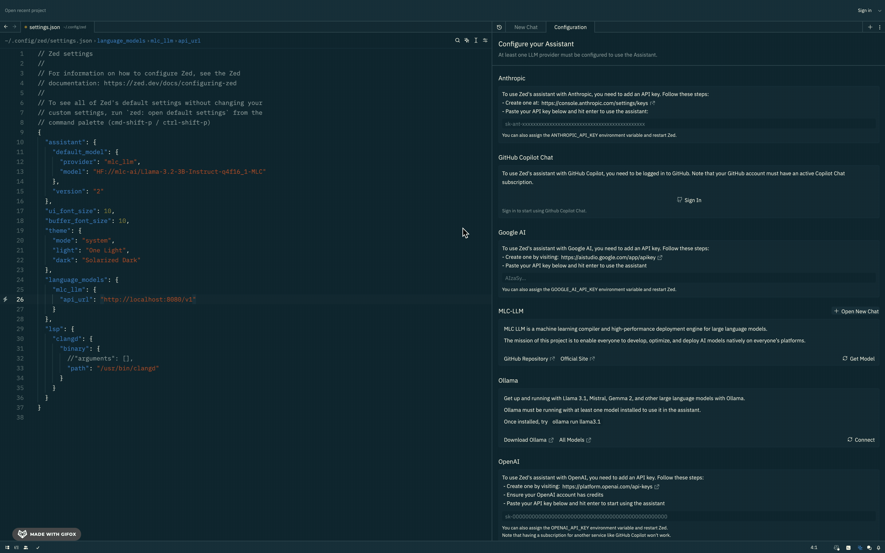
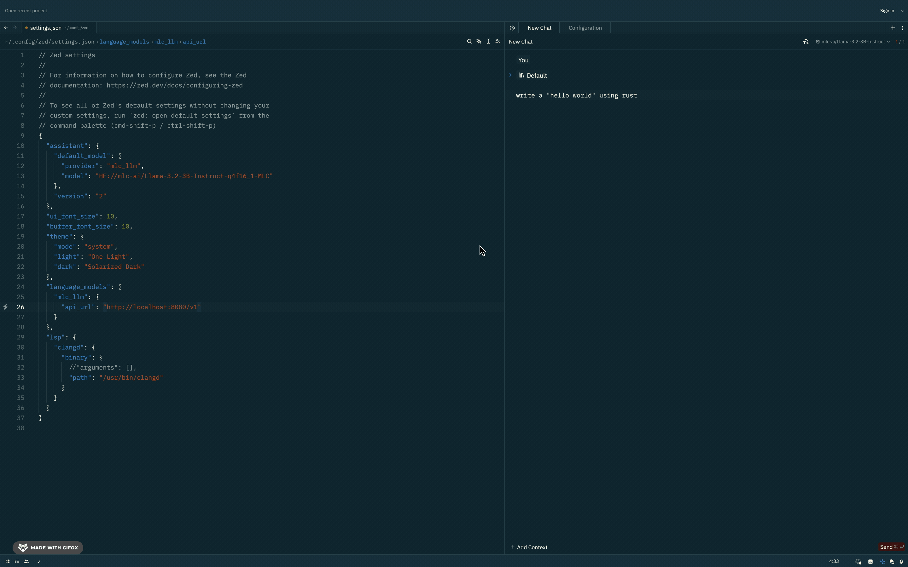

# Zed editor's plugin to add mlc ai assistant

The plugin has changes per tag version of the original repository.

The file [releases.tags](./releases.tags) has the supported versions. **(The first tag version supported is 0.162.5)**

## How to use it

_[**Rust**](https://www.rust-lang.org/ "Rust Lang") and [**Patch**](https://en.wikipedia.org/wiki/Patch_(Unix) "Patch") are required to compile and execute the script._

Basically, the [init.zsh](./init.zsh) script will clone or pull the repository, apply the plugin's changes, compile and execute.

## Credits

[MLC LLM](https://github.com/mlc-ai/mlc-llm "MLC LLM")

[Zed Editor](https://github.com/zed-industries/zed "Zed Editor")
